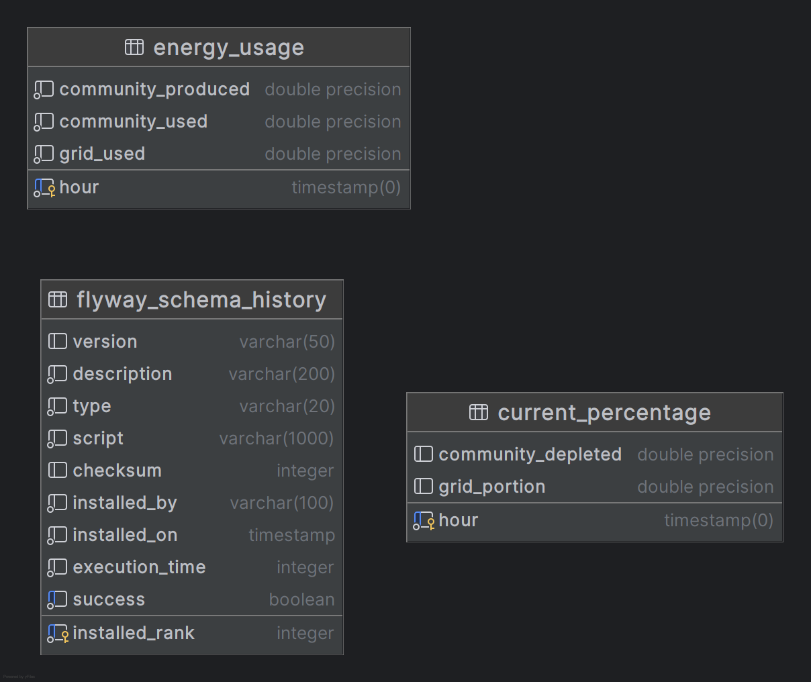

# disys-prj – Energie-Daten Viewer (Powergrid)

## ER-Diagramm – Datenbankmodell PowerGrid

Das Diagramm zeigt drei Tabellen:

- `energy_usage`: Speichert stündlich, wie viel Energie die Community erzeugt, selbst verbraucht und aus dem öffentlichen Netz bezieht.
- `current_percentage`: Enthält stündlich die Prozentanteile von Community- und Netzstrom am Gesamtverbrauch.
- `flyway_schema_history`: Wird automatisch von Flyway erstellt. Sie dokumentiert, welche SQL-Migrationen bereits ausgeführt wurden, um den aktuellen DB-Stand zu verwalten.

## Component Diagramm - PowerGrid

## Technologien
- Java 21 (Zulu FX)
- JavaFX mit FXML (GUI / SceneBuilder)
- Spring Boot (Micro-Services / REST-API / RabbitMQ)
- Spring AMQP (RabbitMQ-Integration)
- Spring Data JPA (PostgreSQL-Persistenz)
- Flyway (DB-Migrationen)
- RabbitMQ (Messaging)
- PostgreSQL (Docker-Container)
- Maven (Build & Dependency Management)

## Projektstruktur (Module)
Jedes Modul ist eigenständig startbar und kommuniziert asynchron über RabbitMQ bzw. HTTP.

### energy-producer
**Verantwortung:** Simuliert lokale Energie-Erzeugung
- **EnergyProducerService**: sendet alle 3 Sekunden JSON-Nachrichten mit kWh-Werten an Queue `energyQueue`.
- **EnergyProducerApplication**: Spring-Boot-Starter, aktiviert Scheduling und legt `energyQueue` an.

### energy-user
**Verantwortung:** Simuliert lokalen Energie-Verbrauch
- **EnergyUserService**: sendet alle 3 Sekunden Verbrauchsdaten an dieselbe `energyQueue`.
- **UserApplication**: Spring-Boot-Starter, legt `energyQueue` an.

### usage-service
**Verantwortung:** Echtzeit-Aggregation von Produktion und Verbrauch
- **UsageService**: hört auf `energyQueue`, aggregiert stündlich in `EnergyUsageEntity`, persistiert in PostgreSQL und schickt die Original-Nachricht weiter an Queue `updateQueue`.
- **UsageApplication**: Spring-Boot-Starter, legt Queues an und aktiviert RabbitMQ-Listener.

### current-percentage-service
**Verantwortung:** Berechnung und Bereitstellung der Netz-Abhängigkeit
- **CurrentPercentageService**: hört auf `updateQueue`, liest stündliche Summen, berechnet `communityDepleted` und `gridPortion`, speichert in `CurrentPercentageEntity`.
- **CurrentPercentageController**: REST-Endpoint `GET /current` liefert aktuellen Grid-Prozentsatz. CORS (`*`) aktiviert.
- **CurrentApplication**: Spring-Boot-Starter, scannt Entities/Repositories, legt `updateQueue` an.

### rest-api
**Verantwortung:** HTTP-Schnittstelle für alle Energiedaten
- **EnergyController** (`/energy`):
    - **GET /current** → liefert aktuelles `EnergyData` (Timestamp, communityDepleted %, gridPortion %).
    - **GET /historical?start=…&end=…** → liefert `HistoricalResponse` (Summen von Production, Usage, Grid).
- **DTOs**: `EnergyData`, `HistoricalResponse`
- **RestApiApplication**: Spring-Boot-Starter, aktiviert Component-Scan und Jackson-Mapping.

### ui-app
**Verantwortung:** JavaFX-GUI zur Visualisierung
- **HelloController**: lädt per `HttpClient` aktuelle und historische Daten, mappt JSON in DTOs, füllt Labels & TextArea.
- **Main**: JavaFX-Launcher, lädt FXML, öffnet Fenster.

### energy-db
**Verantwortung:** Datenmodell & Persistenz
- **Entities**:
    - `EnergyUsageEntity` → Tabelle `energy_usage` (hour, communityProduced, communityUsed, gridUsed)
    - `CurrentPercentageEntity` → Tabelle `current_percentage` (hour, communityDepleted, gridPortion)
- **Repositories**:
    - `EnergyUsageRepository` (extends `JpaRepository`, plus `findByHourBetween`)
    - `CurrentPercentageRepository` (extends `JpaRepository`)

### db-migration
**Verantwortung:** Versioniertes Datenbankschema
- **V1__createEnergyTables.sql** (Flyway):
    - Legt Tabellen `energy_usage` und `current_percentage` in PostgreSQL an
    - Automatisches Einspielen beim App-Start (mit Flyway-Dependency)

## Milestone

### Must Haves (erledigt)
- Every component can be started independently
- System can be built and run with no errors
- Spring Boot used for REST API
- JavaFX used for GUI
- RabbitMQ-Messaging zwischen Modulen

### REST API
- GET `/energy/current` → aktueller Grid-Anteil & Timestamp
- GET `/energy/historical` → aggregierte Summen im Zeitraum

### GUI
- JavaFX-Applikation mit Buttons zur Abfrage
- Anzeige von Community-Deckungsgrad und Netz-Anteil
- Historische Aggregationen als Textausgabe

---
